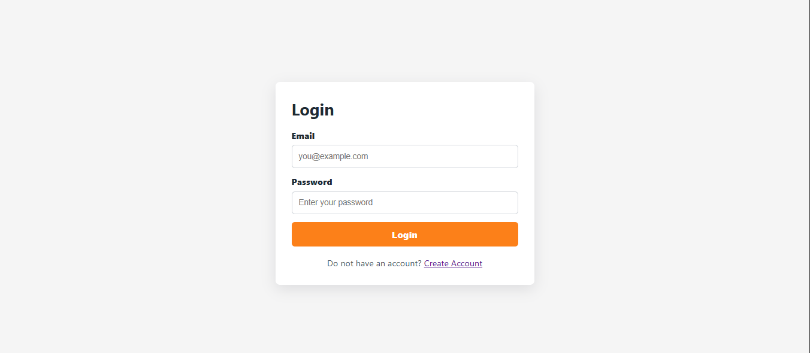
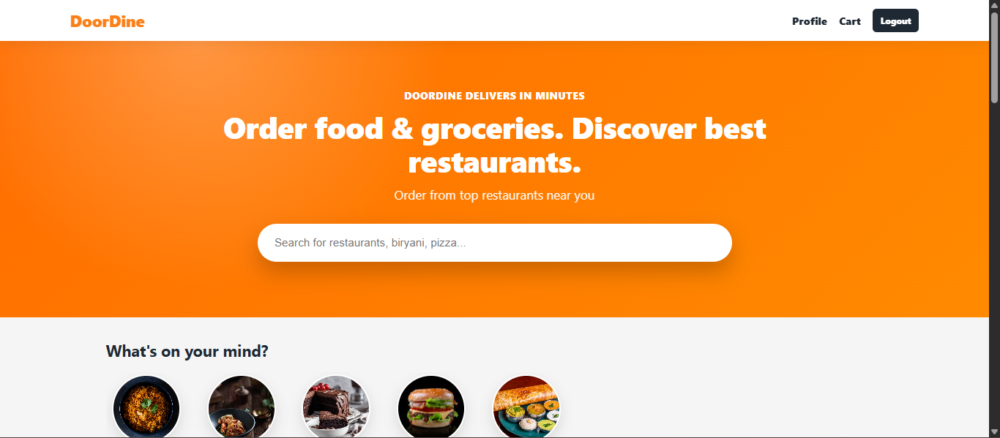
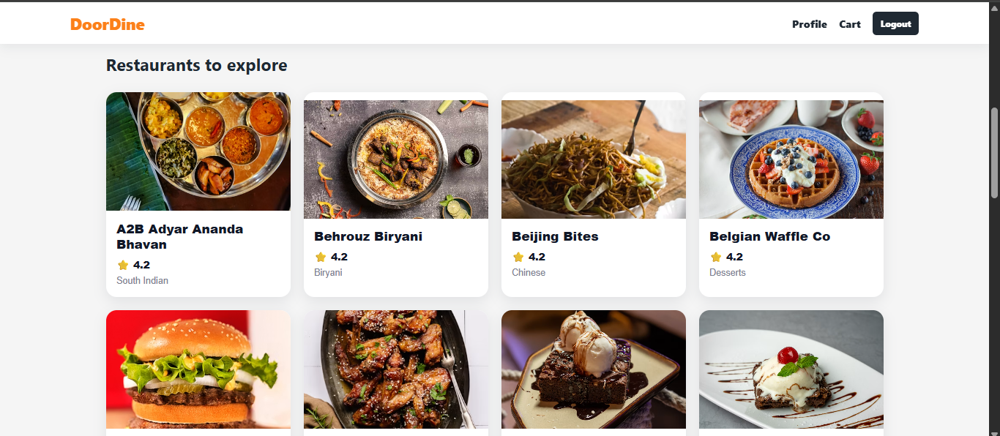
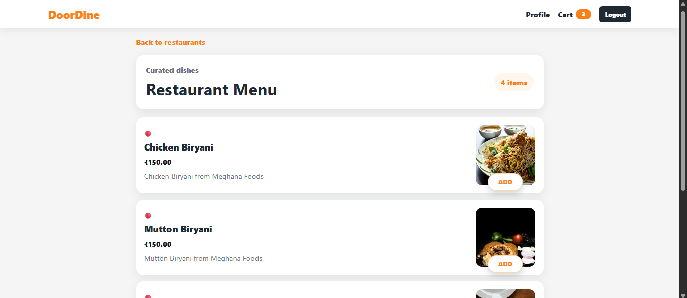
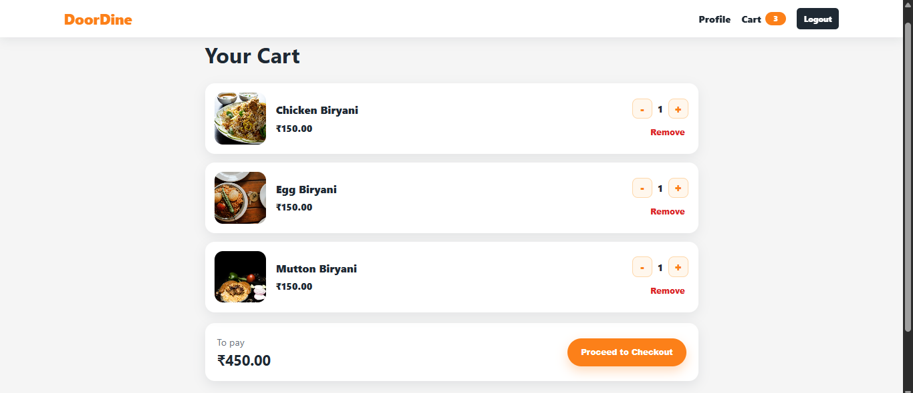
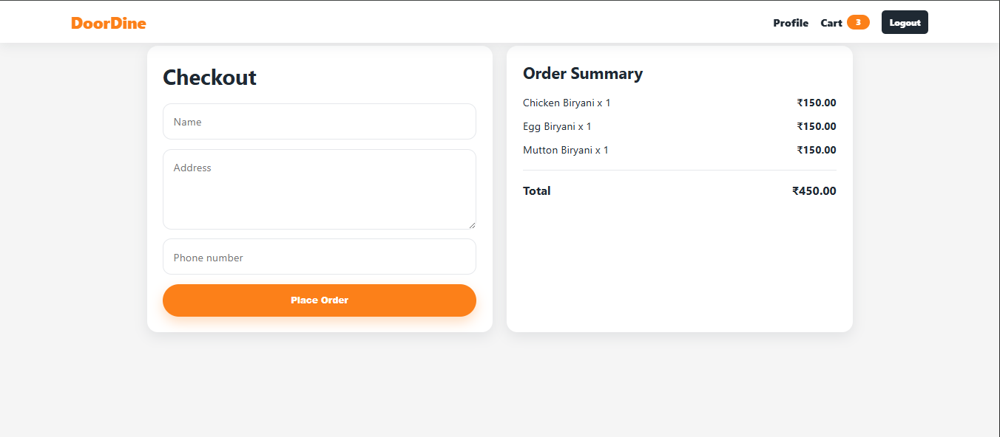
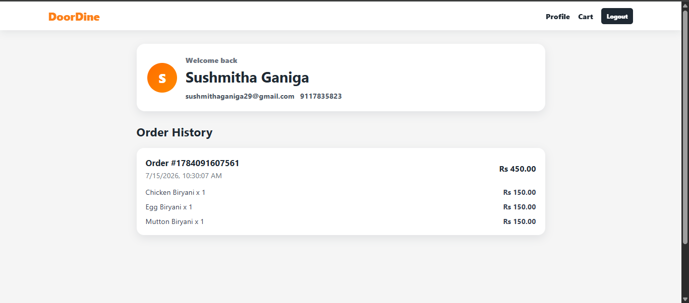

# 🍽️ DoorDine - Food Delivery Web Application

## 📌 Project Description

DoorDine is a full-stack food delivery web application inspired by platforms like Swiggy and Zomato. Users can browse restaurants, explore menu items, register/login securely, add items to the cart, and manage their profiles.

The application is built using React for the frontend and Django REST Framework for the backend.

---

## 🚀 Features

- User Registration
- User Login & JWT Authentication
- Restaurant Listing
- Menu Item Listing
- Food Categories
- Shopping Cart
- User Profile
- Responsive UI
- REST API Integration

---

## 🛠 Tech Stack

### Frontend

- React.js
- React Router
- Axios
- CSS

### Backend

- Django
- Django REST Framework
- JWT Authentication

### Database

- SQLite

### Deployment

- Frontend: Vercel
- Backend: Render

---

## 📷 Screenshots

### Login 



### Home 



### Restaurants 



### Menu 



### Cart 



### Checkout 



### Profile 



## 🌐 Live Demo


https://door-dine-food-delivery-app.vercel.app

---

## ⚙️ Installation

Clone the repository

```bash
git clone YOUR_GITHUB_LINK
```

Go to project folder

```bash
cd DoorDine---food-delivery-app
```

### Backend

```bash
cd food-delivery-backend

python -m venv venv

venv\Scripts\activate

pip install -r requirements.txt

python manage.py migrate

python manage.py runserver
```

### Frontend

```bash
cd food-delivery-frontend

npm install

npm start
```

---

## 📂 Project Structure

```
DoorDine---food-delivery-app
│
├── food-delivery-backend/
├── food-delivery-frontend/
├── screenshots/
└── README.md
```

---

## 👩‍💻 Author

**Sushmitha Ganiga**
